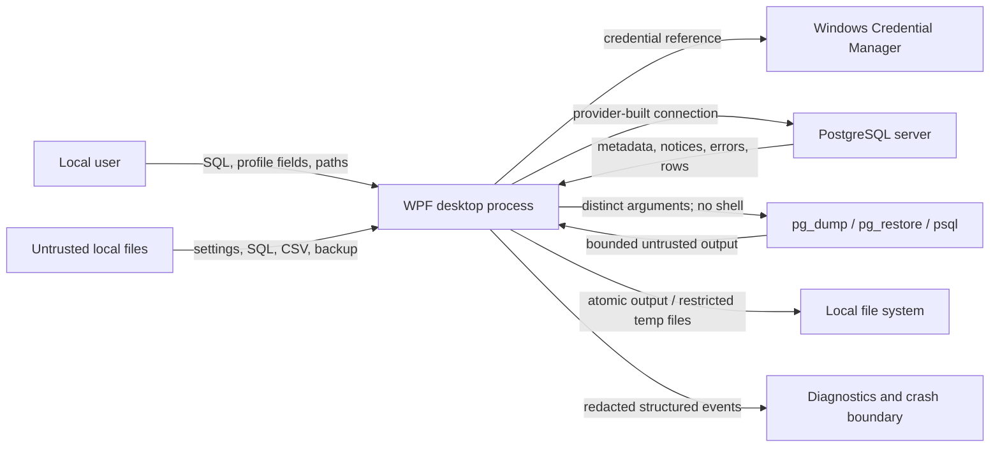

# Sprint 43 Threat Model

Date: 2026-07-29
Scope: PostgreManagementStudio desktop client, local state, PostgreSQL connections, imported/exported files, and PostgreSQL command-line utilities.

## Assets and security objectives

- PostgreSQL passwords, TLS private-key passwords, tokens, and temporary password files must remain confidential.
- SQL, database objects, backups, exports, and saved scripts must retain integrity.
- A command must affect only the server, database, object, and physical-session generation selected by its owning editor.
- The desktop UI must remain available when a server returns malformed, hostile, or very large text.
- Audit and diagnostic output must remain useful without containing credentials, private results, parameter values, or raw SQL by default.

## Trust boundaries

Boundary assumptions:

- PostgreSQL and all database-originated values are untrusted, including names, comments, plans, errors, notices, session application names, and version strings.
- Settings, profiles, SQL files, CSV input, backups, executable paths, and destination paths are untrusted local input.
- Windows Credential Manager protects secrets at rest from casual file access, not from code running as the same compromised Windows user.
- PostgreSQL utilities are privileged external code. Executable discovery is constrained and the process is started directly, but a compromised permitted binary can still access its own inputs and process environment.
- User-authored SQL is intentionally executable and is never confused with internally generated SQL.

## Entry points and privileged operations

Entry points include connection fields, SQL editor text, metadata browsing/search, settings/profile JSON, import files, backup archives, export/save destinations, clipboard actions, PostgreSQL errors/notices, and utility output.

High-impact operations include restore, maintenance, actual-plan execution, schema/security changes, session termination, data replacement, overwrite, and SQL-file replacement. The shared destructive-operation guard requires an exact server and database, refuses uncertain session identity, de-duplicates in-flight executions, and requires typed database confirmation for production-classified targets.

## Threats and mitigations

| Threat | Primary mitigation | Residual risk |
|---|---|---|
| Plaintext password in profile/settings | Profile JSON excludes secret properties; only a stable credential reference is stored; Windows Credential Manager stores an explicit opt-in password | Malware or another process under the same Windows account may retrieve credentials |
| Connection-string property injection | Npgsql builder, typed fields, length/control validation, reviewed advanced-property allowlist; protected `Options`, reset, and error-detail settings cannot be overridden | A future newly added option needs a fresh review |
| Wrong target/session | Editor captures immutable execution context; reconnect increments physical generation; status bar shows server/database/role/environment/read-only/PID; destructive guard requires exact identity | User-authored SQL can still be destructive when deliberately executed |
| Internally generated SQL injection | Values use Npgsql parameters; identifiers use one component-wise quoter; fragments use enums/fixed mappings; routine signatures reject control/comment/statement syntax | Arbitrary stored definitions and user SQL remain executable only through explicit script/execution workflows |
| Malicious metadata/UI injection | WPF text controls, `UntrustedText` control/bidi neutralisation and length bounds, safe file-name derivation; no metadata is sent to a shell | Full-content viewers must continue to use plain text when added |
| Secret in logs/errors | Central recursive `SensitiveDataRedactor` handles strings, URIs, bearer/basic tokens, structured properties, nested exceptions, maintenance, backup, and query diagnostics | Novel unlabeled secret formats may require adding a detector; results copied/exported by the user are intentionally not diagnostic logging |
| Backup utility argument injection | `UseShellExecute=false`, `ArgumentList`, validated executable paths, bounded output, owned process-tree cancellation, protected temporary pgpass cleanup | A compromised utility binary remains trusted code for that invocation |
| Path traversal/partial overwrite | Full-path APIs, safe file-name derivation, overwrite confirmation at UI boundaries, same-directory temporary output and atomic move, cleanup on failure/cancellation | Network filesystems and directory-format backups cannot always provide atomic replacement |
| CSV formula injection | Spreadsheet protection is explicit and defaults on; raw mode preserves exact data | Opening raw CSV in spreadsheet software can execute formula-like values |
| Corrupt/malicious settings | Typed `System.Text.Json` model without polymorphism, enum/numeric/string validation, secure defaults, atomic save, corrupt-file backup | Local user can alter non-secret preferences and connection endpoints |
| Excessive privileges | Current role and read-only state are visible; production defaults to PostgreSQL `default_transaction_read_only=on`; maintenance refuses read-only sessions | Read-only is not a substitute for least-privilege database roles; some DDL and external side effects have PostgreSQL-specific semantics |

## Accepted residual risks

- A compromised Windows account can inspect process memory, control the UI, and call Credential Manager as that user.
- User-authored SQL is a deliberate code-execution surface against the selected PostgreSQL session.
- Screenshots and user-directed clipboard/export can contain sensitive data; they are outside diagnostic logging and require user intent.
- A malicious PostgreSQL server can return semantically misleading but inert text and can consume credentials presented for authentication.
- No client-side mode can make an over-privileged database role a true read-only security principal. Production users should use a database role with server-enforced least privilege.
