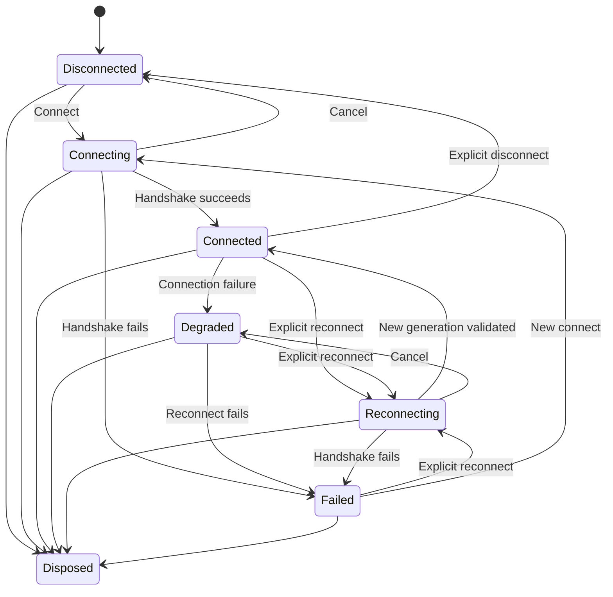

# Sprint 41 — Database Failure Recovery and State Reconciliation

## Completion status

Complete. PostgreManagementStudio now owns a logical connection through one
central recovery session. A failed physical generation degrades the session,
cancels dependent work, preserves user-owned editor/results state, and requires
an explicit reconnect before server commands resume.

## Architecture

`ConnectionRecoverySession` is the authority for lifecycle state, failure
classification, generation identity/cancellation, reconnect serialization,
backend PID, diagnostics, and duplicate-failure suppression. `MainWindow`,
`QueryTabView`, `QueryDocument`, and Object Explorer consume its snapshots
rather than independently inferring connectivity.

Each successful handshake atomically installs a new generation ID, generation
cancellation token, and validation backend PID. Invalid transitions and stale
attempt completions are rejected. Concurrent reconnect and health-check calls
share one in-flight operation. Observer and diagnostics failures are isolated
from the state machine.

## Failure classification

| Category | Detection |
|---|---|
| User cancellation | `OperationCanceledException`, SQLSTATE `57014` |
| Command/connection timeout | timeout exception plus operation phase |
| DNS/network interruption | nested socket errors and SQLSTATE class `08` |
| TLS/certificate failure | authentication/TLS exception or driver message |
| Authentication failure | SQLSTATE `28P01`/`28000` |
| Server shutdown/restart | `57P01`, `57P02`, `57P03` |
| Administrator/backend termination | administrator `57P01`, `57P05` |
| Database unavailable | `3D000`, `57P04` |
| Too many connections | `53300` |
| Protocol/driver failure | `08P01` and classified Npgsql failures |
| Unknown transient/permanent | conservative fallback classification |

Messages are bounded and sanitised. Passwords, connection strings, tokens, and
certificate secrets are not copied into diagnostics or UI error text.

## Reconciliation behavior

- Editor text, selection/undo ownership, dirty state, and prior materialised
  result sessions survive a connection-generation failure.
- Execution completes in a terminal failure state; elapsed indicators stop and
  execute/plan/refresh controls remain disabled until reconnect succeeds.
- Query cancellation handles and old-generation callbacks cannot target or
  mutate a replacement generation.
- Object Explorer retains its existing tree for orientation, marks it stale,
  blocks dead-connection loading, cancels expansion work, and reconciles stable
  expanded/selected identities after reconnect.
- Active health checks run without overlap. Generation cancellation stops
  metadata and query work; eligible services resume only after the new
  handshake.
- A single root failure is published once; duplicate reports are counted
  instead of producing repeated dialogs.

The following backend-owned resources are explicitly considered invalid after
reconnect: temporary tables, session settings, prepared statements, advisory
locks, LISTEN registrations, cursors, transaction objects, `SET ROLE`, search
path changes, session variables, extension-specific state, cached backend PID,
running-query references, and cancellation handles.

## Transaction safety

No transaction command or arbitrary user SQL is replayed. Query transaction
state distinguishes failure before transmission, during execution, after
possible server execution but before acknowledgement, during `COMMIT`, and
during `ROLLBACK`. Commit acknowledgement loss is reported as outcome unknown;
known uncommitted loss is described as server rollback. Reconnection clears
the old physical transaction object and requires the user to verify uncertain
outcomes.

## Retry policy

Automatic retry is available only through `RecoveryRetryPolicy` when an
operation is internal, read-only, idempotent, outside a transaction, not
user-visible SQL, classified transient, cancellable, and attached to the
current generation. Attempts are bounded and use exponential backoff with
jitter. Generation changes, cancellation, permanent failures, or exhaustion
terminate the operation. There are no infinite retry loops.

## Diagnostics

Structured transition diagnostics contain logical session ID, physical
generation ID, previous/new state, safe operation name, failure kind,
SQLSTATE, old/new validation PID, reconnect attempt, duration, and cancelled
dependent count. Diagnostics-sink and subscriber exceptions are contained and
cannot abort connection or query execution.

## Automated verification

The production release runner created a uniquely named disposable PostgreSQL
18.4 database and roles, seeded it, built Release, ran the complete solution,
and removed all test resources:

| Project | Passed |
|---|---:|
| Core | 166 |
| Results | 57 |
| PostgreSQL | 50 |
| Desktop | 13 |
| Live integration | 52 |
| **Total** | **338** |

There were 0 failures and 0 skips. Release build output contained 0 warnings
and 0 errors. Changed Sprint 41 files pass `dotnet format
--verify-no-changes`; `git diff --check` passes. The repository-wide formatter
still reports pre-existing formatting debt in untouched historical files.

Coverage includes transition validity, reconnect serialization/cancellation,
authentication/redaction, physical generation and PID replacement, failure
deduplication, idle health failure, obsolete callbacks, transaction failure
windows, no SQL replay, prior-result preservation, Object Explorer stale
reconciliation, observer isolation, bounded retry/exhaustion, repeated-cycle
disposal, and a real `pg_terminate_backend` recovery.

## Manual verification

| Scenario | Result |
|---|---|
| Idle startup and metadata | PASS — connected state, validation PID, query controls, and Object Explorer root appeared without manual refresh |
| Backend termination | PASS — native shell became Degraded; execution/plan/metadata actions disabled; editor and prior one-row result remained |
| Explicit reconnect | PASS — state returned to Connected and validation PID changed from `32796` to `14628` |
| Post-reconnect SQL | PASS — `SELECT 42 AS recovered` completed with one row and no replay of the terminated command |
| Repeated failures/disposal | PASS — eight deterministic cycles, duplicate-subscriber protection, and idempotent disposal are automated |
| Full Windows service stop/restart | Environment-blocked — the non-elevated test process lacks service-control ACL permission; health-loss behavior is covered deterministically and backend loss is covered live |
| Transaction interruption | PASS in live integration and deterministic failure-window tests; the current shell does not expose user-managed transaction controls for a separate native click-through |

The application stayed responsive throughout native degraded/reconnect
testing. The full-service ACL limitation is a host verification constraint,
not a silent product acceptance claim.

## Known limitations and remaining risks

- Reconnect reuses the in-memory session configuration. If PostgreSQL requires
  changed credentials, the user must use Change Connection; OS-backed saved
  credential management is intentionally outside this sprint.
- The displayed PID is the validated handshake backend PID. Query execution
  uses the application's established per-operation physical-connection model.
- Health polling covers the active shell session. Inactive independent
  sessions detect failure when next used.
- Packaged UI automation and elevated Windows-service restart testing remain
  broader release-engineering work.

No arbitrary user SQL is automatically replayed. Repeated reconnect coverage
confirms cancellation sources, probes, query scopes, timers, and event
subscriptions are disposed or reused without duplicate notifications.
